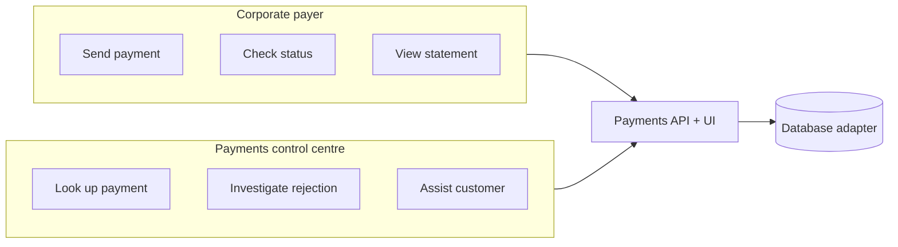

# Why This Project Exists

**Read this first.** Everything else — the spec, the API, the database adapters, the UI — exists to serve the goals below.

This project is built by a **pre-sales solutions engineer** who needs to run credible, repeatable demos with prospects while also producing **objective evidence** about which database fits a realistic payments workload.

---

## The two goals (in order of importance)

### 1. Compare database implementations for a realistic payments application

The core technical mission is to answer: **given the same ISO 20022 payments domain, how do different databases behave?**

We are not building a toy CRUD app. We are building a **minimal but realistic** payments ledger — double-entry, idempotent initiations, concurrency-safe balances, audit trail — and running the **same application** against multiple database backends.

| Comparison dimension | What we measure |
|---------------------|-----------------|
| **Correctness** | All acceptance scenarios pass identically |
| **Concurrency** | Race conditions, duplicate `EndToEndId`, lost updates |
| **Read patterns** | Balance lookups, statement history, support-style searches |
| **Write throughput** | Initiation TPS under load |
| **Operational fit** | Schema design, migrations, indexing, local dev friction |

Initial backends: **PostgreSQL** and **MongoDB**. The architecture must make adding others straightforward.

Performance tests are **first-class**, not an afterthought. Numbers are recorded per adapter and presented alongside correctness results. See [SPEC.md](./SPEC.md) Section 11 (Comparison Harness).

### 2. Be easily demoable — for payers and for support

The second mission is **audience**: this must work in a live customer conversation, not just in a test suite.

A solutions engineer needs to show two sides of the same system:



#### Persona A: End user (corporate payer)

Someone at a customer organisation who **initiates payments** — finance ops, AP clerk, treasury user.

They need to:

- **Log in** as their organisation's demo user
- See their account balance
- Submit a credit transfer (pain.001) with amount, beneficiary, and reference
- Get immediate confirmation or a clear rejection reason (pain.002)
- Review their statement (camt.053)

**Demo moment:** *"Here's how your treasury team would send a supplier payment — ISO 20022 compliant, with an end-to-end reference your auditor can trace."*

#### Persona B: Support worker (payments control centre)

Someone on **your** side — customer support, operations, or technical account management — who helps customers when something goes wrong.

They need to:

- **Log in** to the control centre as a support agent
- Look up a payment by `EndToEndId` (and optionally drill into accounts by UUID)
- See full status lifecycle and ISO rejection codes (`AM04`, `DU04`, `CURR`, etc.)
- View debtor/creditor accounts, balances, and statement entries
- Explain to a customer *why* a payment failed and *what* to do next
- (Stretch) Compare behaviour or performance across database backends during a technical deep-dive

**Demo moment:** *"A customer calls saying their payment failed. Your support team opens the control centre, searches the end-to-end ID, and sees insufficient funds on the debtor account — here's the exact ISO reason code."*

---

## What "demoable" means (requirements)

These constraints apply to **every** implementation decision:

| Requirement | Rationale |
|-------------|-----------|
| **Runs locally in minutes** | SE laptop, prospect meeting room, no fragile setup |
| **Seed data included** | Demo accounts, sample payments, a failed payment to investigate |
| **Two UIs or two modes** | Payer portal + control centre (can be tabs, routes, or separate apps) |
| **Simple login** | Three demo identities — payer + support UIs, benchmark CLI ([AUTH.md](./AUTH.md)) |
| **Readable ISO semantics** | Show `EndToEndId`, `txSts`, `stsRsnInf` — not opaque internal IDs |
| **Switchable database** | `DATABASE=postgres` / `DATABASE=mongo` — same demo, different backend |
| **Scripted demo paths** | Documented 5-minute and 15-minute demo scripts |
| **Benchmark mode** | `benchmarks/` CLI drives load as `benchmark@demo` — not the UI |

Demoability does **not** mean production-ready. It means **credible and conversational**.

---

## How the pieces fit together

```
docs/PURPOSE.md          ← You are here (the why)
docs/SPEC.md             ← Behavioural contract (the what)
docs/SEED.md             ← Demo seed data (accounts, payments)
docs/AUTH.md             ← Demo login users
docs/iso20022/MAPPING.md ← ISO field mapping
docs/openapi.yaml        ← API shape
docs/scenarios/          ← Correctness proof (SC-001–015)
docs/adapters/           ← Per-DB physical schemas + seed files
apps/ (planned)
  ├── api/               ← Ledger service + DB adapter
  ├── payer-ui/          ← Persona A: send payments
  ├── control-centre/    ← Persona B: support lookup
  └── benchmarks/        ← Load tests as benchmark@demo
```

The spec defines **correct behaviour**. This document defines **who it's for and why it matters**. When those conflict, discuss — but default to: *does this help the SE demo or the DB comparison?*

---

## Demo scripts (planned)

### 5-minute demo — "Send a payment"

1. Open **payer UI** — log in as `payer@demo` / `demo`
2. Show account balance
3. Create payment to supplier with `EndToEndId` = invoice number
4. Show pain.002 `ACSC` confirmation
5. Show updated balance and statement entry

### 5-minute demo — "Support investigation"

1. Log in to **control centre** as `support@demo` / `demo`
2. Customer calls: payment `E2E-INV-2024-0999` failed
3. Search by `EndToEndId`
4. Show pain.002 `RJCT` with `AM04` (insufficient funds)
5. Drill into debtor account — show balance vs instructed amount
6. Explain remediation to customer

### 15-minute technical demo — "Database comparison"

1. Run both demos above on **PostgreSQL**
2. Switch to **MongoDB** — identical behaviour
3. Run benchmark suite — show latency and TPS comparison
4. Discuss schema/query trade-offs using real numbers from this app

---

## Success criteria

We have succeeded when:

1. A solutions engineer can run the payer + support demos **without reading source code**
2. All 15 acceptance scenarios pass on **every** database adapter
3. Benchmark results exist for each adapter on the same hardware profile
4. A prospect technical stakeholder can ask *"how would this work on MongoDB vs Postgres?"* and get a live answer

---

## Non-goals (reminder)

This is **not**:

- A production payment processor or licensed PSP
- A full banking core or treasury management system
- An argument that one database always wins

It **is** a realistic, ISO-grounded workload that makes database trade-offs **visible and discussable** in front of customers.

---

## Related documents

| Document | Role |
|----------|------|
| [AUTH.md](./AUTH.md) | Demo login (theatre only) |
| [SEED.md](./SEED.md) | Demo seed data and UUIDs |
| [SPEC.md](./SPEC.md) | Domain rules, API, invariants |
| [iso20022/MAPPING.md](./iso20022/MAPPING.md) | ISO field mapping |
| [scenarios/README.md](./scenarios/README.md) | Compliance tests |
| [adapters/mongodb/SCHEMA.md](./adapters/mongodb/SCHEMA.md) | MongoDB schema |
| [adapters/postgres/SCHEMA.md](./adapters/postgres/SCHEMA.md) | PostgreSQL schema |
| [../README.md](../README.md) | Project entry point |
