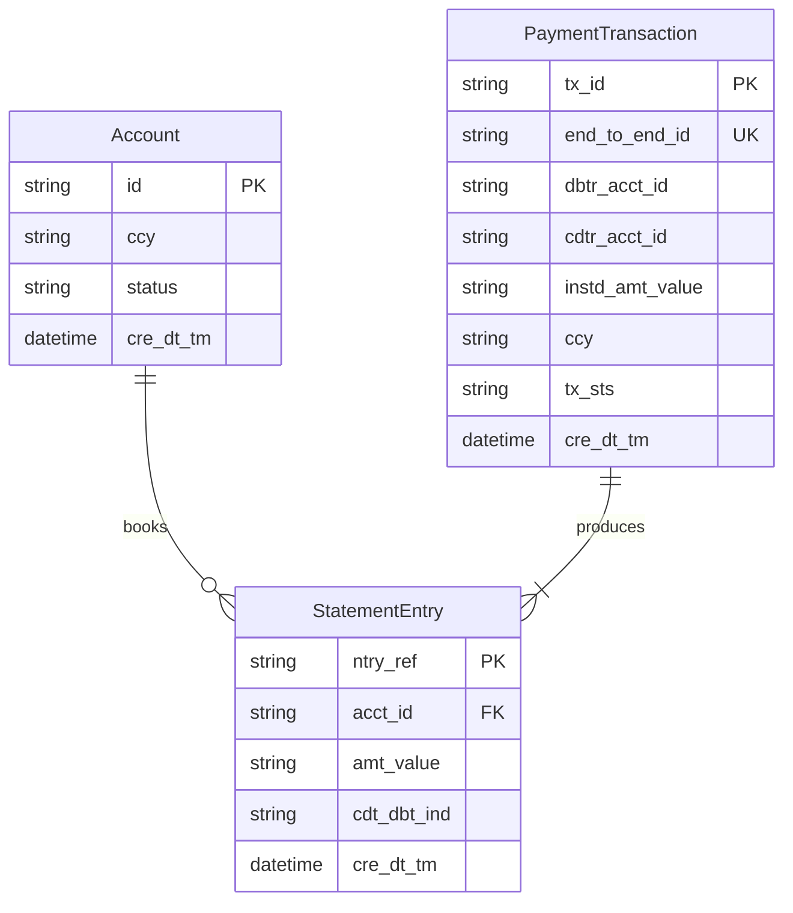
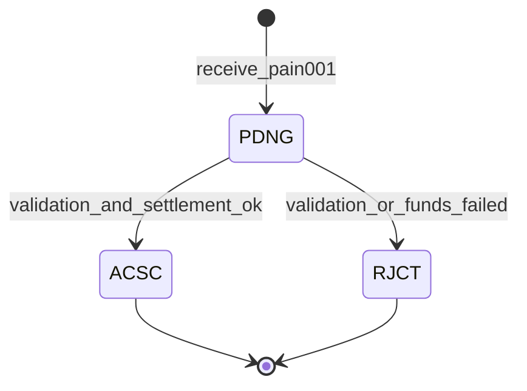

# Payments Ledger Application Specification (v2 — ISO 20022)

**Status:** Canonical source of truth  
**Version:** 2.1.0  
**Last updated:** 2026-06-23  
**ISO 20022 profile:** pain.001.001.09, pain.002.001.10, camt.053.001.08

This document defines the behavior of a minimal double-entry ledger payments application whose **external contract is ISO 20022–compliant**. All database implementations MUST conform to this spec. When behavior is ambiguous, this document wins.

**Project intent** (read first): [PURPOSE.md](./PURPOSE.md)  
**Authentication:** [AUTH.md](./AUTH.md)

Related artifacts:

- [Project purpose & demo personas](./PURPOSE.md)
- [Demo seed data](./SEED.md)
- [Authentication & authorization](./AUTH.md)
- [OpenAPI contract](./openapi.yaml)
- [ISO 20022 field mapping](./iso20022/MAPPING.md)
- [Database adapters](./adapters/)
- [Acceptance scenarios](./scenarios/)
- [JSON fixtures](./fixtures/)

---

## 1. Overview & Goals

### Purpose

This system exists for two reasons (see [PURPOSE.md](./PURPOSE.md)):

1. **Database comparison** — run a realistic payments workload (correctness, concurrency, reads, writes) against multiple database backends and capture performance results.
2. **Pre-sales demoability** — support two personas in live customer conversations: a **corporate payer** initiating payments and a **support worker** investigating them in a payments control centre.

This spec defines the **shared behavioural contract** that every database adapter and demo surface must implement identically. The API is ISO 20022–aligned so demos reflect real payment semantics (`EndToEndId`, `txSts`, `stsRsnInf`), not toy transfers.

### Demo surfaces (planned)

| Surface | Persona | Primary actions |
|---------|---------|-----------------|
| **Payer UI** | Corporate payer | View balance, submit pain.001, check status, view statement |
| **Control centre** | Support / operations | Search by `EndToEndId`, inspect rejections, view accounts, assist customers |
| **Benchmark CLI** | Technical audience | Run perf suite, compare adapters |

All surfaces call the same API. No persona-specific business rules.

### ISO 20022 compliance scope (v1)

| Message | ISO definition | API usage |
|---------|----------------|-----------|
| **pain.001** | Customer Credit Transfer Initiation | `POST /payment-initiations` request body |
| **pain.002** | Customer Payment Status Report | Initiation response + `GET .../status` |
| **camt.053** | Bank-to-Customer Statement | `GET /accounts/{id}/statements` |

The API exposes these messages as **JSON** documents using the element names and code sets defined by ISO 20022. Implementations MAY also accept or emit XML (`application/xml`) as an optional content type; JSON is the compliance test format.

### Definition of Done (v1)

A database adapter is **spec-compliant** when:

1. It exposes the REST API in [Section 4](#4-api-contract) and [openapi.yaml](./openapi.yaml).
2. Request/response payloads validate against the ISO 20022–aligned schemas in OpenAPI.
3. All acceptance scenarios in [docs/scenarios/](./scenarios/) pass.
4. Domain invariants in [Section 3](#3-domain-model) hold after every operation.
5. Concurrency ([Section 6](#6-concurrency--consistency)) and idempotency ([Section 7](#7-idempotency)) requirements are met.

Auth is demo-only — not part of compliance testing ([AUTH.md](./AUTH.md)).

### Design Principles

- **Spec-first:** Business rules live here, not in any one adapter.
- **ISO money format:** Amounts use `ActiveOrHistoricCurrencyAndAmount` — decimal `value` string + ISO 4217 `ccy` attribute. No binary floats in API payloads.
- **Internal precision:** Adapters MAY store amounts as minor-unit integers internally but MUST round-trip API decimal values exactly per currency exponent.
- **Atomic settlement:** A credit transfer either fully settles (`ACSC`) with ledger entries, or is rejected (`RJCT`) with no balance change.
- **Append-only ledger:** Statement entries (`camt.053` `Ntry`) are immutable.
- **DB portability:** Adapters implement a narrow repository port; physical schema is adapter-specific.

---

## 2. Glossary

| Term | ISO element / message | Definition |
|------|----------------------|------------|
| **Account** | `CashAccount40` / `DbtrAcct` / `CdtrAcct` | Balance-holding cash account identified by `Acct.Id` |
| **Party** | `PartyIdentification135` / `Dbtr` / `Cdtr` | Owner of an account (`Nm`, optional `Id`) |
| **Payment initiation** | `CstmrCdtTrfInitn` (pain.001) | Customer request to transfer funds |
| **Credit transfer transaction** | `CdtTrfTxInf` | Single payment within a `PmtInf` block |
| **End-to-end ID** | `PmtId.EndToEndId` | Unique transaction reference; idempotency key (max 35 chars) |
| **Instruction ID** | `PmtId.InstrId` | Optional instructing-party reference (max 35 chars) |
| **Instructed amount** | `Amt.InstdAmt` | Amount ordered by initiating party (`value` + `ccy`) |
| **Transaction status** | `TxSts` (pain.002) | `ACSC`, `RJCT`, `PDNG`, etc. |
| **Status reason** | `StsRsnInf.Rsn.Cd` | ISO external reason code on rejection (e.g. `AM04`) |
| **Statement entry** | `Ntry` (camt.053) | Immutable booked entry with `CdtDbtInd` |
| **Double-entry** | — | Every settled transfer creates one `DBIT` and one `CRDT` entry whose amounts sum to zero |

---

## 3. Domain Model

### 3.1 Entities

#### Account (CashAccount40 + Party)

| Field | ISO path | Type | Constraints |
|-------|----------|------|-------------|
| `id` | `Acct.Id.Othr.Id` | string (UUID) | Server-generated primary key |
| `owner` | `Ownr` / party | `Party` | `nm` required; `id.othr.id` optional external ref |
| `ccy` | `Acct.Ccy` | string | ISO 4217 |
| `bal` | `Bal.Amt` | `CurrencyAndAmount` | Current booked balance |
| `status` | (extension) | enum | `active`, `closed` — not in ISO account type; internal lifecycle |
| `cre_dt_tm` | — | datetime (UTC) | Server-generated |

#### PaymentTransaction (CdtTrfTxInf + status)

| Field | ISO path | Type | Constraints |
|-------|----------|------|-------------|
| `tx_id` | — | string (UUID) | Server-generated internal ID |
| `pmt_id` | `PmtId` | `PaymentIdentification6` | `end_to_end_id` required |
| `dbtr_acct_id` | `DbtrAcct.Id` | string | FK → Account |
| `cdtr_acct_id` | `CdtrAcct.Id` | string | FK → Account; must differ from debtor |
| `instd_amt` | `Amt.InstdAmt` | `CurrencyAndAmount` | `value` > 0 |
| `tx_sts` | `TxSts` | enum | `PDNG`, `ACSC`, `RJCT` |
| `sts_rsn_inf` | `StsRsnInf` | array | Required when `tx_sts = RJCT` |
| `rmt_inf` | `RmtInf` | object | Optional remittance (unstructured `ustrd` or structured) |
| `cre_dt_tm` | — | datetime (UTC) | Server-generated |

#### StatementEntry (Ntry)

| Field | ISO path | Type | Constraints |
|-------|----------|------|-------------|
| `ntry_ref` | `NtryRef` | string (UUID) | Server-generated |
| `acct_id` | — | string | FK → Account |
| `amt` | `Amt` | `CurrencyAndAmount` | Signed via `CdtDbtInd`, not sign of value |
| `cdt_dbt_ind` | `CdtDbtInd` | enum | `DBIT` or `CRDT` |
| `bal` | `Bal` | `CashBalance8` | `Amt` + `CdtDbtInd` after booking |
| `bookg_dt` | `BookgDt.Dt` | date | Booking date |
| `end_to_end_id` | `NtryDtls.TxDtls.Refs.EndToEndId` | string | Links to payment transaction |
| `cre_dt_tm` | — | datetime (UTC) | Server-generated |

### 3.2 Entity Relationships



### 3.3 Domain Invariants

1. **Double-entry:** Every `ACSC` transaction has exactly two statement entries: one `DBIT` on debtor account, one `CRDT` on creditor account, with equal `Amt.value` magnitudes.
2. **Balance integrity:** Account `bal.value` equals net sum of entry amounts (debits subtract, credits add) for that account.
3. **Non-negative balances:** Reject with `RJCT` / `AM04` if debtor balance is insufficient.
4. **Currency match:** `DbtrAcct.Ccy` must equal `CdtrAcct.Ccy` and `InstdAmt.Ccy`.
5. **Immutability:** Statement entries and settled transactions are append-only.
6. **End-to-end idempotency:** Same `EndToEndId` + equivalent `CdtTrfTxInf` body returns original status. Same `EndToEndId` + different body returns `409` / `DU04`.
7. **Amount format:** `InstdAmt.value` decimal places MUST NOT exceed ISO 4217 minor units for the currency (e.g. 2 for USD, 0 for JPY).
8. **No self-transfer:** `DbtrAcct` and `CdtrAcct` must reference different accounts.

### 3.4 Account Lifecycle

| Status | Initiate debit | Receive credit |
|--------|----------------|----------------|
| `active` | Yes | Yes |
| `closed` | No | No |

### 3.5 Transaction Status Lifecycle (pain.002)



| TxSts | Meaning in this system |
|-------|------------------------|
| `PDNG` | Transient; processing in flight |
| `ACSC` | Accepted Settlement Completed — funds moved, entries booked |
| `RJCT` | Rejected — no balance change; `StsRsnInf` mandatory |

> **Note:** `ACSP` (in progress) is not surfaced in v1 because this ledger settles synchronously. Implementations respond with terminal `ACSC` or `RJCT`.

### 3.6 ISO Status Reason Codes (rejections)

| Code | When |
|------|------|
| `AM04` | Insufficient funds |
| `AC04` | Closed account |
| `AM12` | Invalid amount (zero, negative, wrong decimal places) |
| `CURR` | Currency mismatch |
| `DU04` | Duplicate `EndToEndId` with different transaction data |
| `AG01` | Transaction forbidden (e.g. self-transfer) |
| `BE01` | Unknown account (debtor or creditor) |

---

## 4. API Contract

Base URL: `/v1`  
Primary content type: `application/json`  
Timestamps: ISO-8601 UTC  
Amount values: **decimal strings** (never JSON numbers) to preserve precision

Full schema: [openapi.yaml](./openapi.yaml)

### 4.1 Endpoints

| Method | Path | ISO message | Description |
|--------|------|-------------|-------------|
| `GET` | `/health` | — | Liveness |
| `POST` | `/auth/login` | — | Demo login (see [AUTH.md](./AUTH.md)) |
| `POST` | `/accounts` | CashAccount40 | Register account (seed / dev only) |
| `GET` | `/accounts/{id}` | CashAccount40 + Bal | Get account and balance |
| `GET` | `/accounts/{id}/statements` | camt.053 | Paginated statement entries |
| `POST` | `/payment-initiations` | pain.001 → pain.002 | Initiate credit transfer(s) |
| `GET` | `/payment-initiations/transactions/{endToEndId}` | pain.002 | Get transaction status |

Demo routes require `X-Demo-User` header after login. Unauthenticated: `/health`, `/auth/login` only. Details in [AUTH.md](./AUTH.md).

### 4.2 JSON binding convention

ISO XML element names use **camelCase** in JSON:

| ISO XML | JSON field |
|---------|------------|
| `EndToEndId` | `endToEndId` |
| `InstdAmt` | `instdAmt` |
| `CdtTrfTxInf` | `cdtTrfTxInf` |
| `CdtDbtInd` | `cdtDbtInd` |
| `StsRsnInf` | `stsRsnInf` |

Currency amounts:

```json
{
  "value": "50.00",
  "ccy": "USD"
}
```

### 4.3 Demo login

Auth is **demo theatre only** — not production security. Three hardcoded identities (`payer@demo`, `support@demo`, `benchmark@demo`), password `demo`. Full detail: [AUTH.md](./AUTH.md).

- `payer@demo` / `support@demo` — UI logins for demos
- `benchmark@demo` — performance harness only (`X-Demo-User` header, no login in load loop)

- `POST /auth/login` → returns `user` with `role` and `accountIds`
- Subsequent requests send `X-Demo-User: <email>`
- `payer` sees only linked accounts; `support` sees all
- Support uses the same GET endpoints — no separate search API
- Auth is excluded from the compliance scenario suite

### 4.4 Error envelope (non-ISO transport errors)

For HTTP-layer errors outside pain.002 (e.g. malformed JSON):

```json
{
  "error": {
    "code": "VALIDATION_ERROR",
    "message": "Human-readable description",
    "details": {}
  }
}
```

Business rejections on payment initiation are returned as **pain.002** documents with `txSts: RJCT`, not this envelope.

### 4.5 pain.001 request shape (minimal profile)

`POST /payment-initiations`:

```json
{
  "grpHdr": {
    "msgId": "MSG-20260623-0001",
    "creDtTm": "2026-06-23T12:00:00Z",
    "nbOfTxs": "1",
    "ctrlSum": "50.00",
    "initgPty": { "nm": "Acme Corp" }
  },
  "pmtInf": [
    {
      "pmtInfId": "PMT-20260623-0001",
      "pmtMtd": "TRF",
      "dbtr": { "nm": "Acme Corp" },
      "dbtrAcct": { "id": { "othr": { "id": "<debtor-account-uuid>" } }, "ccy": "USD" },
      "cdtTrfTxInf": [
        {
          "pmtId": {
            "instrId": "INSTR-001",
            "endToEndId": "E2E-INV-2024-0558"
          },
          "amt": {
            "instdAmt": { "value": "50.00", "ccy": "USD" }
          },
          "cdtr": { "nm": "Supplier Ltd" },
          "cdtrAcct": { "id": { "othr": { "id": "<creditor-account-uuid>" } }, "ccy": "USD" },
          "rmtInf": { "ustrd": ["Invoice 2024-0558"] }
        }
      ]
    }
  ]
}
```

Fixture: [fixtures/pain001-initiation.json](./fixtures/pain001-initiation.json)

### 4.6 pain.002 response shape

```json
{
  "grpHdr": {
    "msgId": "STS-20260623-0001",
    "creDtTm": "2026-06-23T12:00:01Z"
  },
  "orgnlGrpInfAndSts": {
    "orgnlMsgId": "MSG-20260623-0001",
    "orgnlMsgNmId": "pain.001.001.09",
    "grpSts": "ACSC"
  },
  "orgnlPmtInfAndSts": [
    {
      "orgnlPmtInfId": "PMT-20260623-0001",
      "txInfAndSts": [
        {
          "orgnlEndToEndId": "E2E-INV-2024-0558",
          "txSts": "ACSC"
        }
      ]
    }
  ]
}
```

Rejected transaction:

```json
{
  "txInfAndSts": [
    {
      "orgnlEndToEndId": "E2E-INV-2024-0558",
      "txSts": "RJCT",
      "stsRsnInf": [
        {
          "rsn": { "cd": "AM04" },
          "addtlInf": ["Insufficient funds on debtor account"]
        }
      ]
    }
  ]
}
```

Fixture: [fixtures/pain002-status-acsc.json](./fixtures/pain002-status-acsc.json), [fixtures/pain002-status-rjct.json](./fixtures/pain002-status-rjct.json)

### 4.7 camt.053 statement shape

`GET /accounts/{id}/statements?limit=20&cursor=...`:

```json
{
  "stmt": {
    "id": "STMT-20260623-acc-a1b2",
    "creDtTm": "2026-06-23T12:05:00Z",
    "acct": { "id": { "othr": { "id": "<account-uuid>" } }, "ccy": "USD" },
    "bal": [
      {
        "tp": { "cdOrPrtry": { "cd": "CLBD" } },
        "amt": { "value": "950.00", "ccy": "USD" },
        "cdtDbtInd": "CRDT",
        "dt": { "dt": "2026-06-23" }
      }
    ],
    "ntry": [
      {
        "ntryRef": "ent-001",
        "amt": { "value": "50.00", "ccy": "USD" },
        "cdtDbtInd": "DBIT",
        "sts": "BOOK",
        "bookgDt": { "dt": "2026-06-23" },
        "ntryDtls": [
          {
            "txDtls": [
              {
                "refs": { "endToEndId": "E2E-INV-2024-0558" }
              }
            ]
          }
        ]
      }
    ]
  },
  "nextCursor": null,
  "hasMore": false
}
```

Fixture: [fixtures/camt053-statement.json](./fixtures/camt053-statement.json)

---

## 5. Core Operations

### OP-001: Register Account

**Endpoint:** `POST /accounts`  
**ISO basis:** `CashAccount40` + `PartyIdentification135`

**Steps:**

1. Validate `owner.nm` non-empty.
2. Validate `ccy` is ISO 4217.
3. Generate account `id` (UUID).
4. Insert with `bal = { value: "0", ccy }`, `status = active`.
5. Return account.

**Fixture:** [fixtures/create-account-request.json](./fixtures/create-account-request.json)

---

### OP-002: Get Account

**Endpoint:** `GET /accounts/{id}`

Returns account with current `bal`. Not found → `404` / `BE01` in details.

---

### OP-003: Initiate Credit Transfer (pain.001)

**Endpoint:** `POST /payment-initiations`

**Steps (per `CdtTrfTxInf`, atomic):**

1. Validate `grpHdr` and `pmtInf` structure.
2. Validate `ctrlSum` equals sum of all `instdAmt.value` in batch (if multiple transactions).
3. **Idempotency:** Look up `endToEndId`.
   - Exists + equivalent body → return pain.002 with original `txSts` (HTTP 200).
   - Exists + different body → HTTP 409, pain.002 `RJCT` / `DU04`.
4. Lock debtor and creditor accounts (ascending `id` order).
5. Validate accounts exist → else `RJCT` / `BE01`.
6. Validate: not self-transfer → else `RJCT` / `AG01`.
7. Validate: `instdAmt.value` > 0 with valid decimal scale → else `RJCT` / `AM12`.
8. Validate: both accounts `active` → else `RJCT` / `AC04`.
9. Validate: currencies match → else `RJCT` / `CURR`.
10. Validate: debtor `bal` ≥ `instdAmt` → else `RJCT` / `AM04`.
11. Debit debtor, credit creditor; book two `Ntry` records.
12. Set `txSts = ACSC`; commit.
13. Return pain.002 (HTTP 201 for new, 200 for replay).

**Fixture:** [fixtures/pain001-initiation.json](./fixtures/pain001-initiation.json)

---

### OP-004: Get Transaction Status

**Endpoint:** `GET /payment-initiations/transactions/{endToEndId}`

Returns pain.002 `TxInfAndSts` for the given `endToEndId`. Not found → `404`.

---

### OP-005: Get Account Statement

**Endpoint:** `GET /accounts/{id}/statements`

Returns camt.053–aligned `ntry` list, newest first, cursor-paginated.

**Fixture:** [fixtures/camt053-statement.json](./fixtures/camt053-statement.json)

---

### OP-006: Health Check

**Endpoint:** `GET /health` → `{ "status": "ok" }`

---

## 6. Concurrency & Consistency

| Scenario | Expected outcome |
|----------|------------------|
| Two concurrent debits exceeding balance | One `ACSC`, one `RJCT` / `AM04` |
| Duplicate `endToEndId` in flight | Single transaction; same pain.002 returned |
| Balance read during in-flight transfer | Read committed — pre or post, never partial |
| Concurrent transfers on disjoint account pairs | Both `ACSC` |

**Isolation:** PostgreSQL `SELECT FOR UPDATE` or `SERIALIZABLE`; MongoDB multi-document transactions.

**Lock ordering:** Ascending account `id`.

---

## 7. Idempotency

### 7.1 Key

`PmtId.endToEndId` (mandatory, max 35 characters per ISO `Max35Text`).

No separate `Idempotency-Key` header — `EndToEndId` is the ISO-standard correlation identifier passed unchanged end-to-end.

### 7.2 Equivalence

Two `CdtTrfTxInf` bodies are equivalent if `dbtrAcct.id`, `cdtrAcct.id`, and `amt.instdAmt` (`value` + `ccy`) are identical.

### 7.3 Semantics

| Case | HTTP | pain.002 `txSts` |
|------|------|------------------|
| New `endToEndId` | 201 | `ACSC` or `RJCT` |
| Replay, equivalent | 200 | Original status |
| Replay, different | 409 | `RJCT` / `DU04` |

Retention: at least 24 hours.

---

## 8. Audit & Reporting

- **Balance:** `GET /accounts/{id}` → `bal` (camt.053 `CLBD` closing booked balance).
- **History:** `GET /accounts/{id}/statements` → immutable `ntry` list.
- **Reconciliation (CLI):** Verify `bal.value` equals net of all `ntry` amounts.

---

## 9. Non-Functional Requirements

| Endpoint | p50 | p99 |
|----------|-----|-----|
| `POST /accounts` | < 50ms | < 200ms |
| `GET /accounts/{id}` | < 20ms | < 100ms |
| `POST /payment-initiations` | < 100ms | < 500ms |
| `GET /accounts/{id}/statements` | < 50ms | < 300ms |

Entity IDs: UUID v4. `endToEndId`: client-supplied, max 35 chars.

---

## 10. DB Portability Rules

```
HTTP API → LedgerService → LedgerRepository
                              ├── PostgresAdapter
                              └── MongoAdapter
```

Repository port (illustrative):

```
registerAccount(party, ccy) → Account
getAccount(id) → Account
listStatementEntries(accountId, limit, cursor) → Page<Ntry>
initiateCreditTransfer(pain001) → pain002
getTransactionStatus(endToEndId) → pain002.TxInfAndSts
findByEndToEndId(endToEndId) → PaymentTransaction
```

Adapters MAY store minor-unit integers internally. Conversion rules in [iso20022/MAPPING.md](./iso20022/MAPPING.md).

---

## 11. Comparison Harness

### Who sends the load?

A dedicated **`apps/benchmarks/` CLI** — not the payer UI, control centre, or demo users. It drives the API directly with concurrent HTTP clients (e.g. k6 or a small custom runner).

```
benchmarks run --adapter=postgres --suite=write-heavy
```

The harness authenticates as `benchmark@demo` via `X-Demo-User` header on every request. No login round-trip in the hot path.

### Suites

| Suite | Mix | Purpose |
|-------|-----|---------|
| **Correctness** | — | Runs SC-001–SC-015 (uses `benchmark@demo` or direct header; not measured) |
| **Write-heavy** | 100% `POST /payment-initiations` | Transfer TPS |
| **Read-heavy** | 80% GET balance/statement, 20% writes | Support-style read patterns |
| **Mixed** | 50/50 read/write | Realistic combined load |
| **Seed profile** | Bulk setup | 10K accounts, 1M transfers before timed run |

### Metrics (per adapter)

p50/p95/p99 latency per endpoint, TPS, error rate, conflict/retry rate, storage size after seed.

Results written to `benchmarks/results/<adapter>/<date>.json`.

Pass criteria: correctness scenarios green; perf numbers recorded (not gated).

---

## 12. Out of Scope (v1)

- pain.008 (direct debit), pain.007 (reversal), pacs.008 (interbank)
- XML-only interfaces (JSON is required; XML optional)
- `EqvtAmt` (equivalent amount / FX)
- `ChrgBr` (charge bearer) and fee deduction
- Agent chains (`DbtrAgt`, `CdtrAgt`, BIC routing)
- Mandates, regulatory reporting (AML), UETR
- Async settlement (`ACSP` → `ACSC` over time)
- camt.054 real-time notifications

---

## Appendix A: Scenario Index

| ID | Title | File |
|----|-------|------|
| SC-001 | Register account | [scenarios/SC-001-create-account.md](./scenarios/SC-001-create-account.md) |
| SC-002 | Credit transfer initiation | [scenarios/SC-002-transfer.md](./scenarios/SC-002-transfer.md) |
| SC-003 | Insufficient funds (AM04) | [scenarios/SC-003-insufficient-funds.md](./scenarios/SC-003-insufficient-funds.md) |
| SC-004 | EndToEndId replay | [scenarios/SC-004-idempotent-replay.md](./scenarios/SC-004-idempotent-replay.md) |
| SC-005 | EndToEndId conflict (DU04) | [scenarios/SC-005-idempotency-conflict.md](./scenarios/SC-005-idempotency-conflict.md) |
| SC-006 | Currency mismatch (CURR) | [scenarios/SC-006-currency-mismatch.md](./scenarios/SC-006-currency-mismatch.md) |
| SC-007 | Closed account (AC04) | [scenarios/SC-007-closed-account.md](./scenarios/SC-007-closed-account.md) |
| SC-008 | Double-entry invariant | [scenarios/SC-008-double-entry.md](./scenarios/SC-008-double-entry.md) |
| SC-009 | Balance integrity | [scenarios/SC-009-balance-integrity.md](./scenarios/SC-009-balance-integrity.md) |
| SC-010 | Concurrent transfers | [scenarios/SC-010-concurrent-transfers.md](./scenarios/SC-010-concurrent-transfers.md) |
| SC-011 | Statement pagination | [scenarios/SC-011-pagination.md](./scenarios/SC-011-pagination.md) |
| SC-012 | Transaction not found | [scenarios/SC-012-transfer-not-found.md](./scenarios/SC-012-transfer-not-found.md) |
| SC-013 | Account not found | [scenarios/SC-013-account-not-found.md](./scenarios/SC-013-account-not-found.md) |
| SC-014 | Invalid amount (AM12) | [scenarios/SC-014-amount-validation.md](./scenarios/SC-014-amount-validation.md) |
| SC-015 | Self-transfer (AG01) | [scenarios/SC-015-self-transfer.md](./scenarios/SC-015-self-transfer.md) |

## Appendix B: Fixture Index

| File | Description |
|------|-------------|
| [fixtures/create-account-request.json](./fixtures/create-account-request.json) | Register account |
| [fixtures/create-account-response.json](./fixtures/create-account-response.json) | Account response |
| [fixtures/get-account-response.json](./fixtures/get-account-response.json) | Get account |
| [fixtures/pain001-initiation.json](./fixtures/pain001-initiation.json) | pain.001 initiation |
| [fixtures/pain002-status-acsc.json](./fixtures/pain002-status-acsc.json) | pain.002 settled |
| [fixtures/pain002-status-rjct.json](./fixtures/pain002-status-rjct.json) | pain.002 rejected |
| [fixtures/camt053-statement.json](./fixtures/camt053-statement.json) | camt.053 statement page |
| [fixtures/error-not-found.json](./fixtures/error-not-found.json) | HTTP 404 envelope |
| [fixtures/seed-users.json](./fixtures/seed-users.json) | Demo user accounts |
| [fixtures/auth-login-request.json](./fixtures/auth-login-request.json) | Login request |
| [fixtures/auth-login-response.json](./fixtures/auth-login-response.json) | Login response |

## Appendix C: Demo Seed Index

Full narrative: [SEED.md](./SEED.md)

| File | Format | Purpose |
|------|--------|---------|
| [adapters/mongodb/reference/examples/seed.json](./adapters/mongodb/reference/examples/seed.json) | JSON | Canonical demo ledger data |
| [adapters/postgres/reference/examples/seed.sql](./adapters/postgres/reference/examples/seed.sql) | SQL | Same data for PostgreSQL |
| [fixtures/seed-users.json](./fixtures/seed-users.json) | JSON | Demo login users (API config, not in DB) |

Demo seed is for UI demos and smoke tests. Compliance scenarios (Appendix A) use independent setup.
