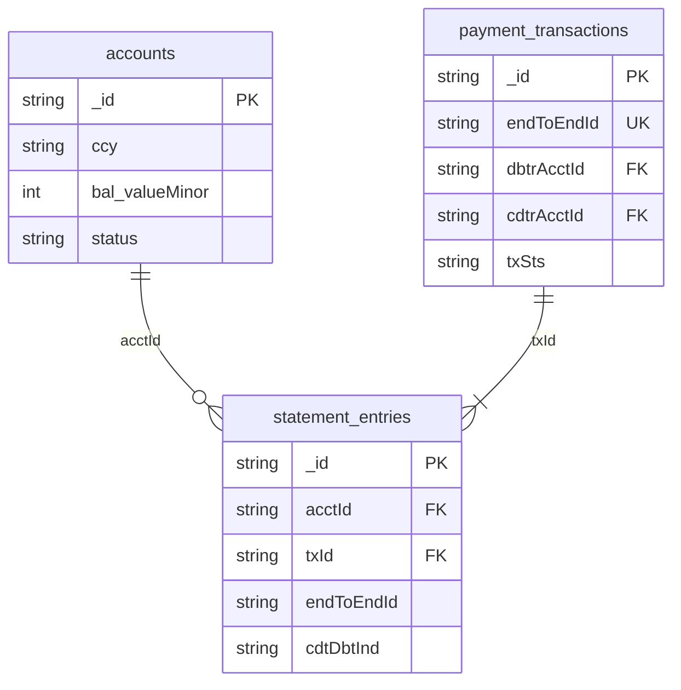

# MongoDB Logical Schema

**Status:** Reference design for `MongoAdapter`  
**Spec:** [SPEC.md](../../SPEC.md) v2.1.0  
**ISO mapping:** [MAPPING.md](../../iso20022/MAPPING.md)

This document defines the physical MongoDB data model for the payments ledger. It follows the [embed vs reference](https://github.com/mongodb/skills/blob/main/mongodb-schema-design/references/fundamental-embed-vs-reference.md) guidance: **data accessed together is stored together**, but unbounded child data lives in separate collections.

---

## Design summary

| Collection | Entity | Cardinality driver | Decision |
|------------|--------|-------------------|----------|
| `accounts` | Account | 1 document per cash account; balance updated atomically with settlement | Own collection |
| `payment_transactions` | PaymentTransaction | Looked up by `endToEndId`; independent of statement history | Own collection |
| `statement_entries` | StatementEntry | Unbounded per account (benchmark target: 1M+ transfers) | Own collection — **do not embed** |

### Why three collections (not one normalized SQL mirror)

1. **Statement entries are unbounded** — embedding `ntry[]` on `accounts` would hit the 16MB document limit and degrade every balance read.
2. **Independent access patterns** — `GET /payment-initiations/transactions/{endToEndId}` never needs statement rows; `GET /accounts/{id}/statements` never needs the full payment document.
3. **Concurrency** — settlement locks two `accounts` documents and inserts into `payment_transactions` + two `statement_entries` inside a multi-document transaction ([SPEC §6](../../SPEC.md#6-concurrency--consistency)).

### Amount storage

API payloads use ISO decimal strings (`"50.00"`). MongoDB documents store **minor-unit integers** per [MAPPING.md](../../iso20022/MAPPING.md):

```json
{ "valueMinor": 5000, "ccy": "USD" }
```

The adapter converts at the repository boundary; round-trip must preserve API precision.

### Field naming

Documents use **camelCase** to align with the JSON API binding (`endToEndId`, `creDtTm`, `cdtDbtInd`). Domain-model snake_case names in [SPEC §3.1](../../SPEC.md#31-entities) map 1:1 after case conversion.

---

## Collections

### `accounts`

Holds current booked balance and account lifecycle state.

| Field | Type | Required | Notes |
|-------|------|----------|-------|
| `_id` | string (UUID) | yes | Same as API `id` |
| `owner` | object | yes | `{ nm, id? }` — ISO `PartyIdentification135` |
| `ccy` | string | yes | ISO 4217; immutable after create |
| `bal` | object | yes | `{ valueMinor: int, ccy }` — denormalized closing booked balance |
| `status` | enum | yes | `active` \| `closed` |
| `creDtTm` | date | yes | UTC creation timestamp |
| `schemaVersion` | int | yes | Document schema version (currently `1`) |

**Indexes:** `_id` (default).

**Write pattern:** `$inc` on `bal.valueMinor` during settlement inside a transaction, after validating non-negative balance.

---

### `payment_transactions`

One document per `CdtTrfTxInf`. Serves idempotency, status lookup, and audit.

| Field | Type | Required | Notes |
|-------|------|----------|-------|
| `_id` | string (UUID) | yes | Internal `txId` |
| `pmtId` | object | yes | `{ endToEndId, instrId? }` — **unique** idempotency key |
| `dbtrAcctId` | string | yes | FK → `accounts._id` |
| `cdtrAcctId` | string | yes | FK → `accounts._id`; must ≠ debtor |
| `instdAmt` | object | yes | `{ valueMinor: int (>0), ccy }` |
| `txSts` | enum | yes | `PDNG` \| `ACSC` \| `RJCT` |
| `stsRsnInf` | array | if `RJCT` | ISO status reasons (`rsn.cd`, `addtlInf?`) |
| `rmtInf` | object | no | `{ ustrd?: string[] }` |
| `idempotencyBody` | object | yes | Normalized replay fingerprint for `DU04` detection |
| `creDtTm` | date | yes | UTC creation timestamp |
| `schemaVersion` | int | yes | Document schema version (currently `1`) |

**`idempotencyBody`** stores the equivalence fields from [SPEC §7.2](../../SPEC.md#72-equivalence):

```json
{
  "dbtrAcctId": "<uuid>",
  "cdtrAcctId": "<uuid>",
  "instdAmt": { "valueMinor": 5000, "ccy": "USD" }
}
```

**Indexes:**

| Keys | Options | Purpose |
|------|---------|---------|
| `{ "pmtId.endToEndId": 1 }` | unique | Idempotency ([OP-003](../../SPEC.md#op-003-initiate-credit-transfer-pain001)) |
| `{ "txId": 1 }` | unique, sparse alias optional | Lookup by internal ID |
| `{ "dbtrAcctId": 1, "creDtTm": -1 }` | — | Control-centre debtor history (future) |

Rejected transactions (`RJCT`) are persisted with **no** statement entries and **no** balance change.

---

### `statement_entries`

Append-only booked ledger lines (`camt.053` `Ntry`). Immutable after insert.

| Field | Type | Required | Notes |
|-------|------|----------|-------|
| `_id` | string (UUID) | yes | Same as `ntryRef` |
| `acctId` | string | yes | FK → `accounts._id` |
| `txId` | string | yes | FK → `payment_transactions._id` |
| `endToEndId` | string | yes | Denormalized from payment — support search |
| `amt` | object | yes | `{ valueMinor: int (>0), ccy }` — magnitude always positive |
| `cdtDbtInd` | enum | yes | `DBIT` \| `CRDT` |
| `bal` | object | yes | `{ valueMinor, ccy, cdtDbtInd }` — balance **after** this entry |
| `bookgDt` | string | yes | ISO date `YYYY-MM-DD` |
| `sts` | enum | yes | Always `BOOK` in v1 |
| `creDtTm` | date | yes | UTC; drives pagination sort |
| `schemaVersion` | int | yes | Document schema version (currently `1`) |

**Indexes:**

| Keys | Options | Purpose |
|------|---------|---------|
| `{ "acctId": 1, "creDtTm": -1, "_id": -1 }` | — | Statement pagination, newest first ([OP-005](../../SPEC.md#op-005-get-account-statement)) |
| `{ "endToEndId": 1 }` | — | Control-centre lookup by E2E |
| `{ "txId": 1 }` | — | Double-entry verification (exactly 2 entries per `ACSC` tx) |

---

## Entity relationships



---

## Settlement write sequence (ACSC)

Inside a single multi-document transaction:

1. `findOneAndUpdate` both accounts (ascending `_id` lock order) with session/transaction.
2. Validate invariants (funds, currency, status, not self-transfer).
3. `insertOne` `payment_transactions` with `txSts: ACSC`.
4. `insertMany` two `statement_entries` (debtor `DBIT`, creditor `CRDT`).
5. `$inc` debtor `bal.valueMinor` by `-amount`, creditor by `+amount`.
6. `commitTransaction`.

On rejection: insert `payment_transactions` with `txSts: RJCT` + `stsRsnInf`; no entry or balance changes.

---

## Schema validation

Collection validators use MongoDB `$jsonSchema` ([reference JSON](./reference/)). Apply with:

```javascript
// See reference/create-collections.js for runnable setup
```

Start with `validationLevel: "strict"` and `validationAction: "error"` on greenfield collections.

---

## Reference artifacts

| File | Purpose |
|------|---------|
| [reference/_defs.json](./reference/_defs.json) | Shared type definitions (documentation) |
| [reference/accounts.validator.json](./reference/accounts.validator.json) | `accounts` `$jsonSchema` |
| [reference/payment_transactions.validator.json](./reference/payment_transactions.validator.json) | `payment_transactions` `$jsonSchema` |
| [reference/statement_entries.validator.json](./reference/statement_entries.validator.json) | `statement_entries` `$jsonSchema` |
| [reference/indexes.json](./reference/indexes.json) | Index definitions |
| [reference/examples/seed.json](./reference/examples/seed.json) | Full demo seed (canonical JSON) |
| [reference/examples/seed.js](./reference/examples/seed.js) | mongosh loader script |
| [reference/examples/](./reference/examples/) | Individual sample documents |
| [reference/create-collections.js](./reference/create-collections.js) | Bootstrap script |

Apply schema and seed:

```bash
# Collections + validators
mongosh "$MONGODB_URI" --file docs/adapters/mongodb/reference/create-collections.js

# Demo seed (from project root)
mongosh "$MONGODB_URI" --file docs/adapters/mongodb/reference/examples/seed.js
```

Demo seed narrative: [SEED.md](../../SEED.md)

## Application users (auth)

**Demo login users are not stored in MongoDB.** There is no `users` collection and no auth data in the ledger database.

Auth is demo theatre only ([AUTH.md](../../AUTH.md)). The three identities (`payer@demo`, `support@demo`, `benchmark@demo`) live in application config, loaded from the canonical fixture:

| Artifact | Path |
|----------|------|
| Demo users (canonical) | [fixtures/seed-users.json](../../fixtures/seed-users.json) |

The API resolves them in the **HTTP layer**, not via `LedgerRepository`:

1. `POST /auth/login` — validate email/password against the hardcoded list.
2. Subsequent requests — read `X-Demo-User` and look up `role` + `accountIds` from the same list.

No JWT, no password hashes, no sessions collection. Auth is excluded from the compliance scenario suite (SC-001–015).

### Linking users to ledger accounts

`accountIds` on a demo user (e.g. payer → Acme) is a **fixture reference** to `accounts._id`. It is not a foreign key in MongoDB and is not written during seed load.

| Concept | Stored where | Example |
|---------|--------------|---------|
| App login user | `seed-users.json` / in-memory | `payer@demo` |
| Cash account | `accounts` collection | `a1b2c3d4-e5f6-7890-abcd-ef1234567890` |
| ISO account owner (party) | `accounts.owner` embedded field | `{ "nm": "Acme Corp" }` |

`accounts.owner.id.othr.id` (e.g. `"user_123"`) is an ISO external party reference — **not** the demo login email.

### Seed data note

[reference/examples/seed.json](./reference/examples/seed.json) includes a `users` array **for documentation only** (same content as `seed-users.json`). The [seed.js](./reference/examples/seed.js) loader inserts `accounts`, `payment_transactions`, and `statement_entries` only — it does **not** insert users into MongoDB.

---

## Out of scope (v1)

- **`users` collection** — demo auth is outside the database (see above)
- Embedding pain.001 `grpHdr` / `pmtInf` wrappers (API concern only)
- TTL on idempotency records (retain ≥24h; no expiry in v1)
- Time-series collections for entries (standard collection sufficient at v1 scale)
- Separate `parties` collection (owner embedded on account — 1:1, always co-accessed)
