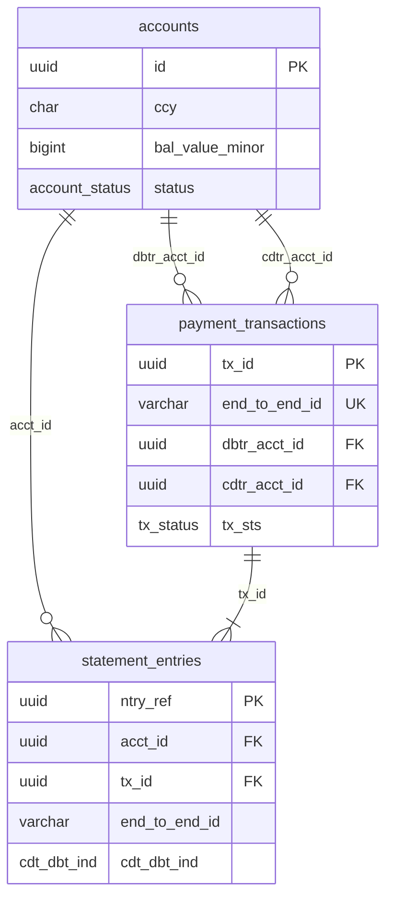

# PostgreSQL Logical Schema

**Status:** Reference design for `PostgresAdapter`  
**Spec:** [SPEC.md](../../SPEC.md) v2.1.0  
**ISO mapping:** [MAPPING.md](../../iso20022/MAPPING.md)  
**Parallel:** [MongoDB schema](../mongodb/SCHEMA.md)

This document defines the physical PostgreSQL data model for the payments ledger. It implements the **same three-entity logical model** as MongoDB — accounts, payment transactions, statement entries — using normalized tables, native types, and `SELECT FOR UPDATE` for concurrency ([SPEC §6](../../SPEC.md#6-concurrency--consistency)).

---

## Design summary

| Table | Entity | Notes |
|-------|--------|-------|
| `accounts` | Account | Denormalized `bal_value_minor`; row locked during settlement |
| `payment_transactions` | PaymentTransaction | Unique `end_to_end_id`; idempotency fingerprint in dedicated columns |
| `statement_entries` | StatementEntry | Append-only; paginated by `(acct_id, cre_dt_tm DESC, ntry_ref DESC)` |

### MongoDB parity

| Concept | MongoDB | PostgreSQL |
|---------|---------|------------|
| Primary keys | `_id` (UUID string) | `UUID` columns (`id`, `tx_id`, `ntry_ref`) |
| Amounts | `{ valueMinor, ccy }` embedded | `*_value_minor BIGINT` + `*_ccy CHAR(3)` columns |
| Owner party | Embedded `owner` object | `owner_nm` + optional `owner_external_id` |
| Idempotency fingerprint | `idempotencyBody` object | `idempotency_*` columns |
| Status reasons | `stsRsnInf` array (JSON) | `sts_rsn_inf JSONB` |
| Remittance | `rmtInf` object (JSON) | `rmt_inf JSONB` |
| Field naming | camelCase | snake_case (SPEC §3.1 domain model) |

### Amount storage

API payloads use ISO decimal strings. Tables store **minor-unit integers** (`BIGINT`) per [MAPPING.md](../../iso20022/MAPPING.md). The adapter converts at the repository boundary.

---

## Tables

### `accounts`

| Column | Type | Constraints | Notes |
|--------|------|-------------|-------|
| `id` | `UUID` | PK | Server-generated; API `id` |
| `owner_nm` | `VARCHAR(140)` | NOT NULL | ISO `PartyIdentification135.Nm` |
| `owner_external_id` | `VARCHAR(35)` | NULL | ISO `Id.Othr.Id` |
| `ccy` | `CHAR(3)` | NOT NULL | ISO 4217; immutable |
| `bal_value_minor` | `BIGINT` | NOT NULL, `>= 0` | Current booked balance |
| `status` | `account_status` | NOT NULL | `active` \| `closed` |
| `cre_dt_tm` | `TIMESTAMPTZ` | NOT NULL | UTC creation |
| `schema_version` | `SMALLINT` | NOT NULL, `= 1` | Schema version |

**Write pattern:** `UPDATE accounts SET bal_value_minor = bal_value_minor - $amt WHERE id = $dbtr ...` inside a transaction after `SELECT ... FOR UPDATE` (ascending `id` order).

---

### `payment_transactions`

| Column | Type | Constraints | Notes |
|--------|------|-------------|-------|
| `tx_id` | `UUID` | PK | Internal transaction ID |
| `end_to_end_id` | `VARCHAR(35)` | NOT NULL, UNIQUE | Idempotency key |
| `instr_id` | `VARCHAR(35)` | NULL | Optional instruction ID |
| `dbtr_acct_id` | `UUID` | NOT NULL, FK → `accounts` | Debtor |
| `cdtr_acct_id` | `UUID` | NOT NULL, FK → `accounts` | Creditor; `≠ dbtr_acct_id` |
| `instd_amt_value_minor` | `BIGINT` | NOT NULL, `> 0` | Instructed amount |
| `instd_amt_ccy` | `CHAR(3)` | NOT NULL | Currency |
| `tx_sts` | `tx_status` | NOT NULL | `PDNG` \| `ACSC` \| `RJCT` |
| `sts_rsn_inf` | `JSONB` | NULL | Required when `RJCT` (enforced by CHECK) |
| `rmt_inf` | `JSONB` | NULL | `{ "ustrd": ["..."] }` |
| `idempotency_dbtr_acct_id` | `UUID` | NOT NULL | Fingerprint for DU04 |
| `idempotency_cdtr_acct_id` | `UUID` | NOT NULL | Fingerprint for DU04 |
| `idempotency_amt_value_minor` | `BIGINT` | NOT NULL, `> 0` | Fingerprint for DU04 |
| `idempotency_amt_ccy` | `CHAR(3)` | NOT NULL | Fingerprint for DU04 |
| `cre_dt_tm` | `TIMESTAMPTZ` | NOT NULL | UTC creation |
| `schema_version` | `SMALLINT` | NOT NULL, `= 1` | Schema version |

**`idempotency_*` columns** mirror MongoDB `idempotencyBody` and [SPEC §7.2](../../SPEC.md#72-equivalence) equivalence fields.

**CHECK constraints:**

- `dbtr_acct_id <> cdtr_acct_id`
- `tx_sts <> 'RJCT' OR sts_rsn_inf IS NOT NULL`

Rejected transactions (`RJCT`) have **no** statement entries and **no** balance change.

---

### `statement_entries`

| Column | Type | Constraints | Notes |
|--------|------|-------------|-------|
| `ntry_ref` | `UUID` | PK | Entry ID; API `ntryRef` |
| `acct_id` | `UUID` | NOT NULL, FK → `accounts` | Account booked |
| `tx_id` | `UUID` | NOT NULL, FK → `payment_transactions` | Originating payment |
| `end_to_end_id` | `VARCHAR(35)` | NOT NULL | Denormalized for E2E search |
| `amt_value_minor` | `BIGINT` | NOT NULL, `> 0` | Positive magnitude |
| `amt_ccy` | `CHAR(3)` | NOT NULL | Currency |
| `cdt_dbt_ind` | `cdt_dbt_ind` | NOT NULL | `DBIT` \| `CRDT` |
| `bal_value_minor` | `BIGINT` | NOT NULL, `>= 0` | Balance after entry |
| `bal_ccy` | `CHAR(3)` | NOT NULL | Currency |
| `bal_cdt_dbt_ind` | `cdt_dbt_ind` | NOT NULL | Sign of balance after entry |
| `bookg_dt` | `DATE` | NOT NULL | Booking date |
| `sts` | `entry_status` | NOT NULL | Always `BOOK` in v1 |
| `cre_dt_tm` | `TIMESTAMPTZ` | NOT NULL | Pagination sort key |
| `schema_version` | `SMALLINT` | NOT NULL, `= 1` | Schema version |

Entries are **immutable** after insert (application-enforced; no `UPDATE`/`DELETE` in adapter).

---

## Entity relationships



---

## Indexes

| Table | Index | Purpose |
|-------|-------|---------|
| `payment_transactions` | `UNIQUE (end_to_end_id)` | Idempotency (OP-003) |
| `payment_transactions` | `(dbtr_acct_id, cre_dt_tm DESC)` | Debtor payment history |
| `statement_entries` | `(acct_id, cre_dt_tm DESC, ntry_ref DESC)` | Statement pagination (OP-005) |
| `statement_entries` | `(end_to_end_id)` | Control-centre E2E lookup |
| `statement_entries` | `(tx_id)` | Double-entry verification (SC-008) |

---

## Settlement write sequence (ACSC)

Inside a single database transaction:

1. `SELECT * FROM accounts WHERE id IN ($dbtr, $cdtr) ORDER BY id FOR UPDATE` — ascending lock order.
2. Validate invariants (existence, funds, currency, status, not self-transfer).
3. `INSERT INTO payment_transactions ...` with `tx_sts = 'ACSC'`.
4. `INSERT INTO statement_entries` × 2 (debtor `DBIT`, creditor `CRDT`).
5. `UPDATE accounts SET bal_value_minor = bal_value_minor - $amt WHERE id = $dbtr` (with `>= $amt` guard).
6. `UPDATE accounts SET bal_value_minor = bal_value_minor + $amt WHERE id = $cdtr`.
7. `COMMIT`.

On rejection: `INSERT` payment with `tx_sts = 'RJCT'` + `sts_rsn_inf`; no entries or balance updates.

**Isolation:** `READ COMMITTED` with row locks is sufficient for v1 scenarios. `SERIALIZABLE` is an acceptable alternative per [SPEC §6](../../SPEC.md#6-concurrency--consistency).

---

## Enum types

| Type | Values |
|------|--------|
| `account_status` | `active`, `closed` |
| `tx_status` | `PDNG`, `ACSC`, `RJCT` |
| `cdt_dbt_ind` | `DBIT`, `CRDT` |
| `entry_status` | `BOOK` |
| `iso_reason_code` | `AM04`, `AC04`, `AM12`, `CURR`, `DU04`, `AG01`, `BE01` |

`sts_rsn_inf` JSONB shape (validated at application layer; optional `jsonb` CHECK in future):

```json
[
  {
    "rsn": { "cd": "AM04" },
    "addtlInf": ["Insufficient funds on debtor account"]
  }
]
```

---

## Reference artifacts

| File | Purpose |
|------|---------|
| [reference/schema.sql](./reference/schema.sql) | DDL — types, tables, constraints, indexes |
| [reference/indexes.json](./reference/indexes.json) | Index catalog (parity with MongoDB) |
| [reference/examples/seed.sql](./reference/examples/seed.sql) | Full demo seed (canonical SQL) |

Apply schema and seed:

```bash
# Schema only
psql "$DATABASE_URL" -f docs/adapters/postgres/reference/schema.sql

# Schema + demo seed
psql "$DATABASE_URL" \
  -f docs/adapters/postgres/reference/schema.sql \
  -f docs/adapters/postgres/reference/examples/seed.sql
```

Demo seed narrative: [SEED.md](../../SEED.md)

---

## Application users (auth)

**Demo login users are not stored in PostgreSQL.** There is no `users` table and no auth data in the ledger database.

Auth is demo theatre only ([AUTH.md](../../AUTH.md)). The three identities (`payer@demo`, `support@demo`, `benchmark@demo`) live in application config, loaded from the canonical fixture:

| Artifact | Path |
|----------|------|
| Demo users (canonical) | [fixtures/seed-users.json](../../fixtures/seed-users.json) |

The API resolves them in the **HTTP layer**, not via `LedgerRepository`:

1. `POST /auth/login` — validate email/password against the hardcoded list.
2. Subsequent requests — read `X-Demo-User` and look up `role` + `accountIds` from the same list.

No JWT, no password hashes, no `sessions` table. Auth is excluded from the compliance scenario suite (SC-001–015).

### Linking users to ledger accounts

`accountIds` on a demo user (e.g. payer → Acme) is a **fixture reference** to `accounts.id`. It is not a foreign key in the schema and is not inserted by [seed.sql](./reference/examples/seed.sql).

| Concept | Stored where | Example |
|---------|--------------|---------|
| App login user | `seed-users.json` / in-memory | `payer@demo` |
| Cash account | `accounts` table | `a1b2c3d4-e5f6-7890-abcd-ef1234567890` |
| ISO account owner (party) | `accounts.owner_nm`, `owner_external_id` | `Acme Corp` |

`accounts.owner_external_id` (e.g. `"user_123"`) is an ISO external party reference — **not** the demo login email.

---

## Out of scope (v1)

- **`users` table** — demo auth is outside the database (see above)
- Partitioning `statement_entries` by `bookg_dt` (future scale optimization)
- Materialized views for balance reconciliation (CLI verifies inline)
- Separate `parties` table (owner columns on `accounts` — 1:1)
- Row-level security (authorization enforced in API middleware, not PostgreSQL RLS)
